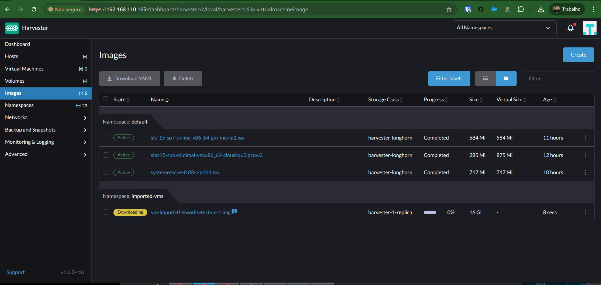

# Harvester VM Import UI

This add-on provides a user-friendly web interface for the Harvester VM Import Controller, allowing users to import virtual machines from vCenter into Harvester through a simple, wizard-driven process.

# Features
* Manage vCenter sources directly from the UI (Create/Delete).
* Select a pre-configured vCenter source to browse its inventory.
* Manage plans: See details or delete with confirmation.
* Map source vCenter networks to target Harvester VLANs.
* Select a target Harvester Namespace and StorageClass for imported VMs.


# Quick Start (TL;DR)

1. Find the Kubeconfig file for your Harvester/SUSE Virtualization cluster (click on "Support" at the lower left on UI).
2. Pull and run the latest version indicating the Kubeconfig file (docker works too):
```
podman run -p 8080:8080 \
  -v ~/myharvester-kubeconfig:/kubeconfig:ro \
  ghcr.io/doccaz/vm-import-ui:latest
```
3. Open your browser at http://localhost:8080
4. Create a vCenter Source with your credentials
5. Create a Migration Plan and select a VM to migrate from the inventory.
6. Check the progress, wait a bit... you're done!

# Screenshots

Access the UI: open your web browser and navigate to http://localhost:8080.


Select the Source VM from the inventory:


Configure the destination VM:


Select the destination namespace:


Map the source and destionation networks for the imported VM:


A summary will be shown with the actions that will be taken:


The VM Import Controller objects and created, and the migration process is submitted:


The migration process is monitored:


And... the VM is created in Harvester!



# Building Locally and Testing

Step 1: Build the Container ImageFrom the project's root directory, build the image using Podman or Docker.

Using Podman
```
podman build -t vm-import-ui:local .
```

Step 2: Run the Container

Run the container, mapping port 8080 and mounting your local kubeconfig file.

Using Podman
```
podman run -p 8080:8080 -v ~/.kube/config:/kubeconfig:ro -e KUBECONFIG=/kubeconfig vm-import-ui:local
```

Step 3: Enabling Debugging

To see verbose logs from the backend, set the LOG_LEVEL environment variable.

Using Podman
```
podman run -p 8080:8080 \
  -v ~/myharvester-kubeconfig:/kubeconfig:ro \
  -e LOG_LEVEL=debug \
  vm-import-ui:local
```

# Workarounds

In one case, the VSphere host (with a .lan domain) was not being correctly resolved by podman's internal DNS. You can overrride the internal resolv.conf to point to your own DNS like this:

```
podman run -p 8080:8080 \
  -v ~/myharvester-kubeconfig:/kubeconfig:ro \
  -v /etc/resolv.conf:/etc/resolv.conf:ro \
  ghcr.io/doccaz/vm-import-ui:latest
```

