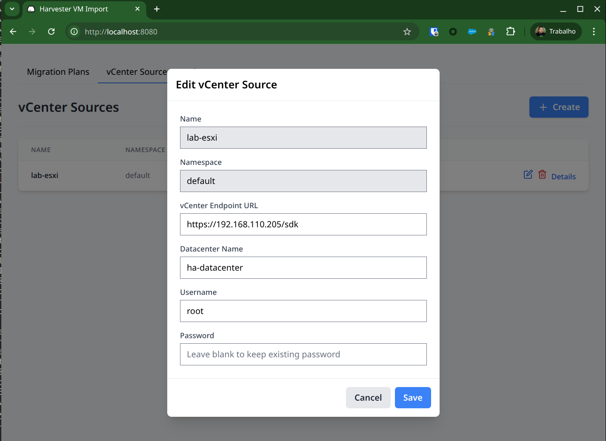
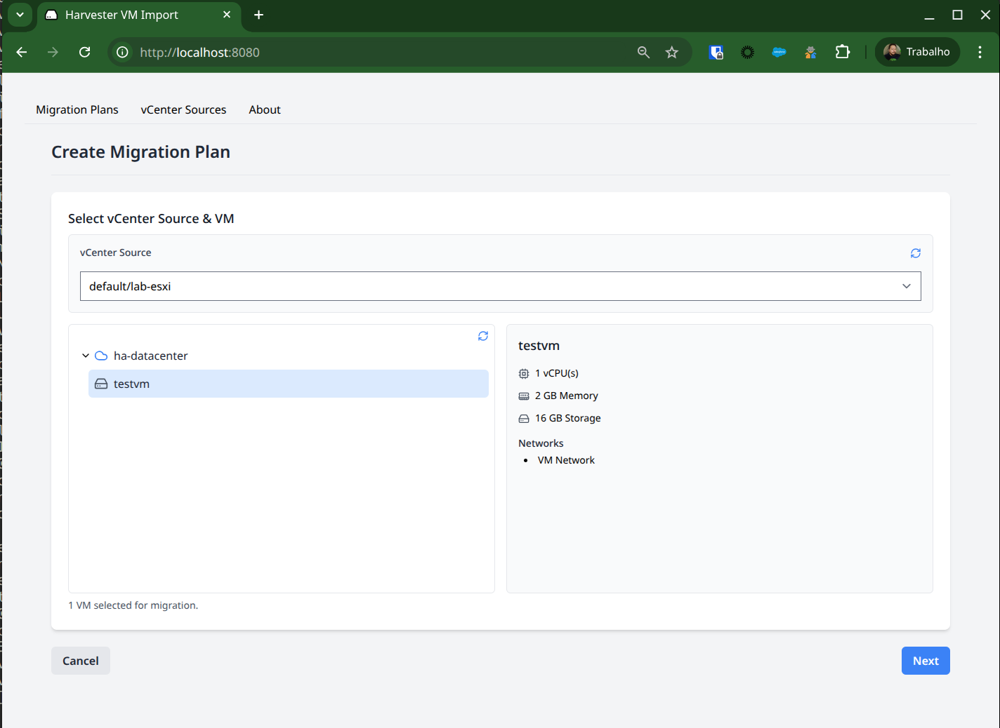
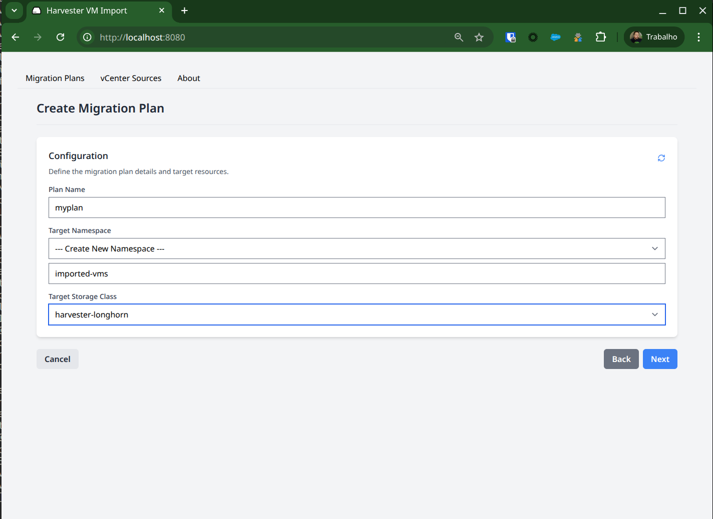
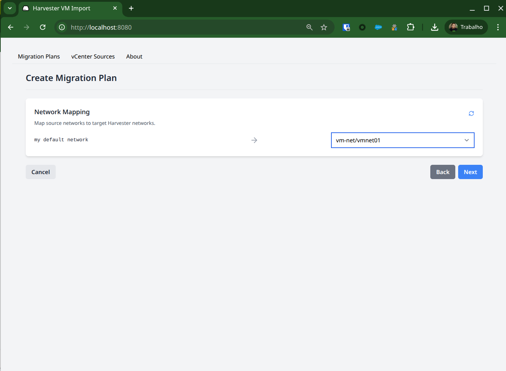
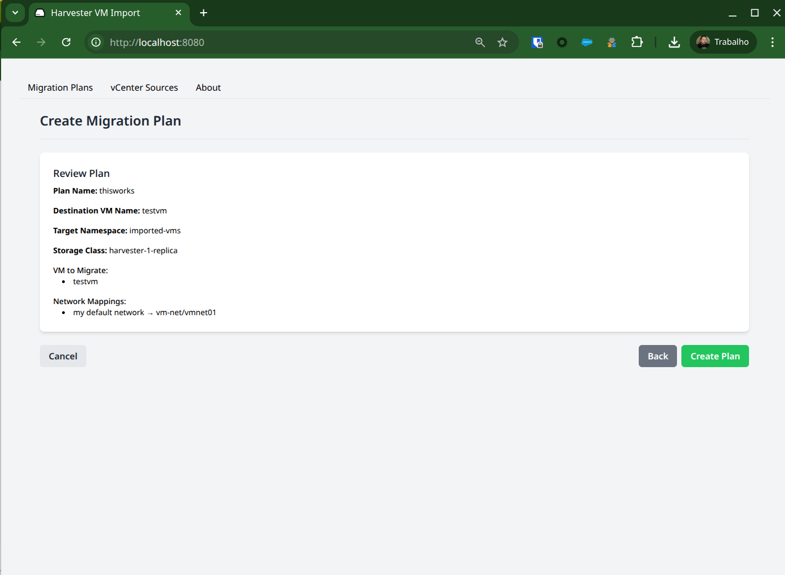
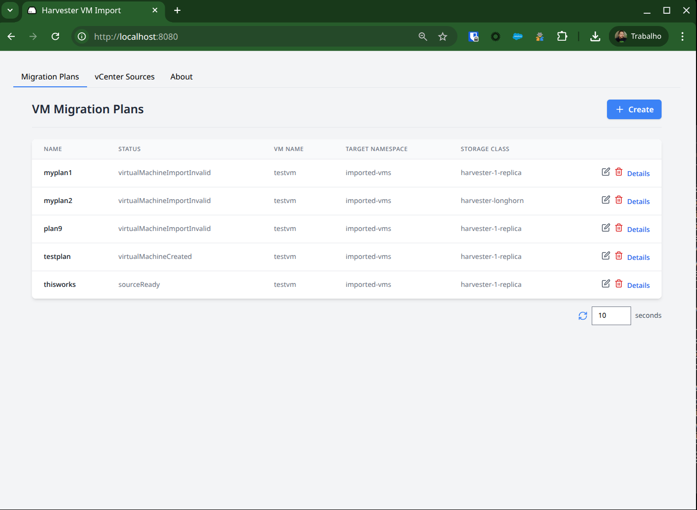

# Harvester VM Import UI

This add-on provides a user-friendly web interface for the Harvester VM Import Controller, allowing users to import virtual machines from vCenter into Harvester through a simple, wizard-driven process.

# Features
* Manage vCenter sources directly from the UI (Create/Delete).
* Select a pre-configured vCenter source to browse its inventory.
* Manage plans: See details or delete with confirmation.
* Map source vCenter networks to target Harvester VLANs.
* Select a target Harvester Namespace and StorageClass for imported VMs.
# Building and Testing

Step 1: Build the Container ImageFrom the project's root directory, build the image using Podman or Docker.

Using Podman
```
podman build -t vm-import-ui:local .
```

Step 2: Run the Container

Run the container, mapping port 8080 and mounting your local kubeconfig file.

Using Podman
```
podman run -p 8080:8080 -v ~/.kube/config:/kubeconfig:ro -e KUBECONFIG=/kubeconfig vm-import-ui:local
```

Step 3: Enabling Debugging

To see verbose logs from the backend, set the LOG_LEVEL environment variable.

Using Podman
```
podman run -p 8080:8080 \
  -v ~/.kube/config:/kubeconfig:ro \
  -e KUBECONFIG=/kubeconfig \
  -e LOG_LEVEL=debug \
  vm-import-ui:local
```

Step 4: Access the UI

Open your web browser and navigate to http://localhost:8080.















