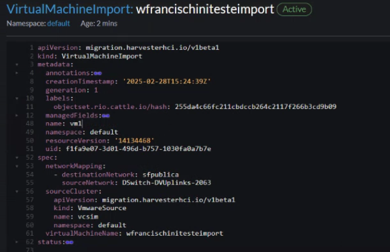
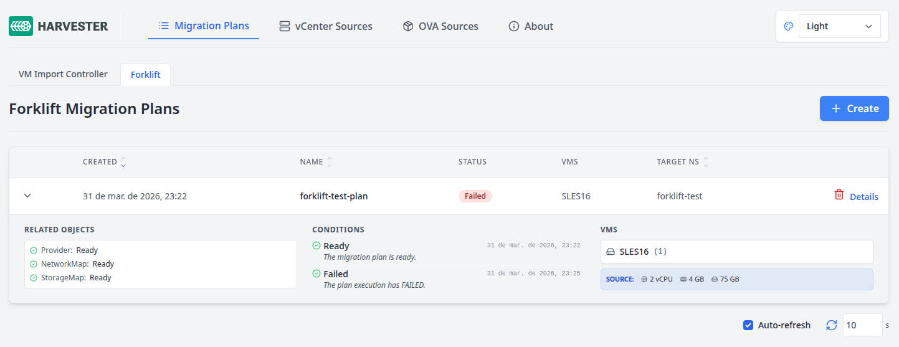
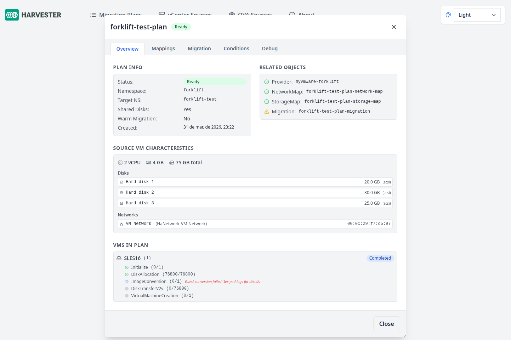
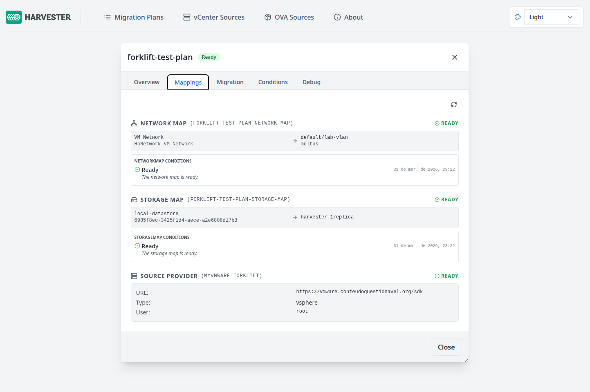
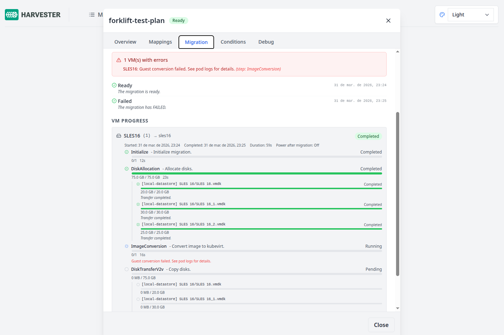
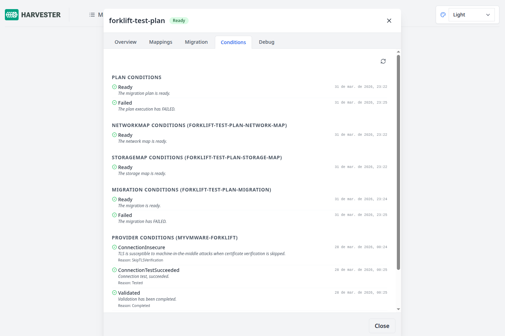
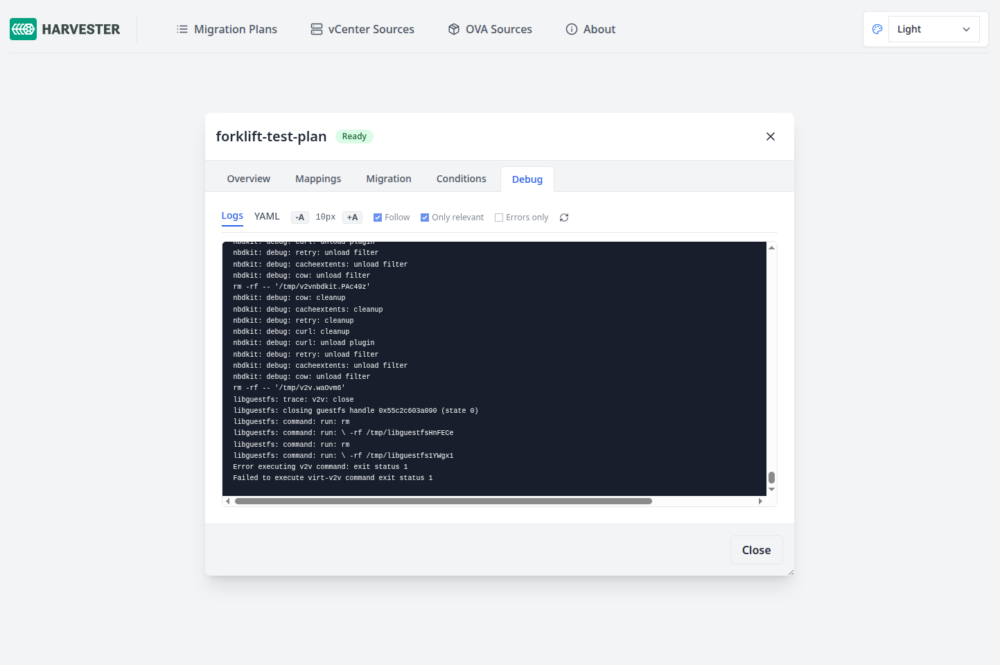

# Harvester VM Import UI

A web-based interface for importing virtual machines into [Harvester / SUSE Virtualization](https://harvesterhci.io/) clusters. Supports two migration engines — the native VM Import Controller and Forklift (Konveyor Migration Toolkit for Virtualization) — driven by a unified wizard-based UI.

---

## Features

### Migration Engines

Both engines are available from the same wizard. Select the one that best fits your environment.

#### VM Import Controller (native Harvester)

- **Source types**: VMware vCenter or flat OVA file
- **vCenter Source Explorer**:
  - Browse the full vCenter inventory (Datacenter → Cluster → Host → VM)
  - Power On / Off / Reset / Graceful Shutdown VMs before migration
  - Rename source VMs directly from the UI
  - Edit MAC addresses on individual NICs
- **Migration wizard**:
  - Automated network and storage mapping
  - Per-NIC interface model selection (v1.6+)
  - Disk bus type selection (v1.6+)
  - Force power-off and configurable shutdown timeout (v1.6+)
  - Skip preflight validation option (v1.6+)
  - Annotations tracking: original CPU, memory, and disk characteristics saved on the plan
- **Plan management**:
  - List, inspect, run, and delete plans
  - Integrated log viewer — toggle between full controller logs and plan-filtered logs
  - YAML view for created CRs

#### Forklift (Konveyor / Migration Toolkit for Virtualization)

- **Provider types**: vSphere (vCenter or standalone ESXi) and OVA (NFS-mounted)
- **Provider management**:
  - Create, edit, and delete Forklift Providers
  - TLS options per provider: skip verification or supply a custom CA certificate
  - VDDK init image configuration for optimised disk transfer (dramatically faster than the fallback method)
  - Automatic annotation when no VDDK image is provided
  - Availability check with configurable Forklift namespace
- **Migration wizard**:
  - Network mapping: map source vSphere networks / port groups to pod network or Multus attachments
  - Storage mapping: map source datastores (vSphere) or disks (OVA) to destination storage classes, with volume mode and access mode selection
  - Custom destination VM name (RFC-1123 compliant)
  - Migration options: warm migration, migrate shared disks, volume populator labels, preserve cluster CPU model, preserve static IPs, default NIC model
- **Plan detail view** (tabbed):
  - **Overview**: provider, target namespace, VM list, readiness status
  - **Mappings**: live NetworkMap and StorageMap status with condition badges
  - **Migration**: per-VM progress bars and phase tracking
  - **Conditions**: full condition list with timestamps
  - **Debug**: aggregated logs from Forklift controller and virt-v2v worker pods
- **Full lifecycle**: run, cancel, delete migration; delete plan with cleanup of NetworkMap + StorageMap
- **YAML view** for Plans, NetworkMaps, StorageMaps, and Migration CRs

### General UI

- **Three themes**: Light, SUSE, Dark (switchable at runtime)
- **About screen** with version and build info
- **Version-aware capabilities**: detects Harvester v1.6+ to unlock advanced options
- **Responsive layout** with resizable log/debug panels
- **Support Bundle** (`About` page): one-click download of a redacted diagnostics `.tar.gz` containing cluster capabilities, all migration CRs (with `status.conditions`), network/storage maps, source/provider definitions, and (opt-in) live vCenter inventory. Secret values are never included; an anonymization option hashes VM/folder/network names for privacy. A spinner shows progress while the archive is being assembled, with inline error feedback on failure.

---

## Quick Start

1. Obtain the kubeconfig for your Harvester / SUSE Virtualization cluster (**Support → Download KubeConfig** in the Harvester UI).
2. Pull and run the container (Podman or Docker):

```bash
podman run -p 8080:8080 \
  -v ~/myharvester-kubeconfig:/kubeconfig:ro \
  ghcr.io/doccaz/vm-import-ui:latest
```

3. Open your browser at **http://localhost:8080**
4. Create a vCenter Source (for VMIC) or a Forklift Provider (for Forklift)
5. Create a Migration Plan, select the VM, configure mappings
6. Run the plan and monitor progress — done!

> **DNS note**: if your vSphere host uses a `.lan` or private domain that the container cannot resolve, mount your host resolver:
> ```bash
> podman run -p 8080:8080 \
>   -v ~/myharvester-kubeconfig:/kubeconfig:ro \
>   -v /etc/resolv.conf:/etc/resolv.conf:ro \
>   ghcr.io/doccaz/vm-import-ui:latest
> ```

---

## In-Cluster Deployment (Helm)

To run the UI **inside** the Harvester cluster (no local kubeconfig needed — the pod
authenticates with its own ServiceAccount), use the Helm chart in [`charts/vm-import-ui`](charts/vm-import-ui).

**From the published Helm repo** (GitHub Pages):

```bash
helm repo add vm-import-ui https://doccaz.github.io/vm-import-ui
helm repo update
helm install vm-import-ui vm-import-ui/vm-import-ui \
  --namespace vm-import-ui --create-namespace \
  --set service.nodePort=32000 \
  --set image.tag=latest
```

**Or directly from the chart source** in this repo:

```bash
helm install vm-import-ui ./charts/vm-import-ui \
  --namespace vm-import-ui --create-namespace \
  --set service.nodePort=32000 \
  --set image.tag=latest
```

Then browse to `http://<any-node-ip>:32000` (the `helm install` output prints the exact URL).

The chart creates a Deployment, a NodePort Service, and a ServiceAccount with a ClusterRole
granting access to Harvester, KubeVirt, CDI, the VM Import Controller, and Forklift resources.

| Common value | Default | Purpose |
|--------------|---------|---------|
| `image.tag` | chart `appVersion` | Image tag to deploy (`latest` for the newest build) |
| `service.nodePort` | `32000` | Fixed NodePort (must be 30000–32767; high in range to avoid collisions) |
| `service.type` | `NodePort` | Service type (`ClusterIP`/`LoadBalancer` also supported) |
| `env.logLevel` | `info` | `debug` \| `info` \| `warn` \| `error` |
| `rbac.create` | `true` | Create the ClusterRole + binding |

Package a versioned tarball with `helm package charts/vm-import-ui`.

---

## Screenshots — VM Import Controller

Create a vCenter source:


Browse the vCenter inventory and select a VM:


Configure the destination VM:


Map source and destination networks:


Review the migration plan summary:


Migration plan created and submitted:


Monitor migration progress:


VM successfully created in Harvester:


YAML view for a migration plan:


---

## Screenshots — Forklift













---

## Building Locally

**Step 1 — Build the container image**

```bash
podman build -t vm-import-ui:local .
```

**Step 2 — Run the container**

```bash
podman run -p 8080:8080 \
  -v ~/.kube/config:/kubeconfig:ro \
  -e KUBECONFIG=/kubeconfig \
  vm-import-ui:local
```

**Step 3 — Enable debug logging**

```bash
podman run -p 8080:8080 \
  -v ~/myharvester-kubeconfig:/kubeconfig:ro \
  -e LOG_LEVEL=debug \
  vm-import-ui:local
```

**Run tests**

```bash
# Go backend
cd pkg && go test -v ./...

# React frontend
cd frontend && npx react-scripts test --watchAll=false
```

---

## Environment Variables

| Variable | Default | Description |
|----------|---------|-------------|
| `KUBECONFIG` | `/kubeconfig` | Path to kubeconfig file |
| `LOG_LEVEL` | `info` | Log level: `debug`, `info`, `warn`, `error` |
| `UI_PATH` | `/ui` | Path to frontend build directory |
| `USE_MOCK_DATA` | `false` | Run without a Kubernetes cluster (dev mode) |

---

## Latest Release (v1.8.1)

- **Works behind a sub-path / reverse proxy** (e.g. the Rancher cluster Service proxy): the frontend now loads assets via relative paths and rewrites API calls relative to where it is served, so the in-dashboard NavLink renders fully. Direct NodePort/Ingress/podman access at the root path is unchanged.
- **Graceful API errors instead of crashed connections**: a panic-recovery middleware returns HTTP 500 on handler panics, and the capabilities endpoint degrades to defaults when no cluster is reachable (e.g. `USE_MOCK_DATA=true`).
- Helm chart: Rancher Apps integration (icon, README, install form), a `ui.cattle.io` **NavLink** menu entry (group defaults to "Utilities"), and chart `appVersion` auto-synced to the app version on release.

## Release (v1.8.0)

- **Edit VMIC migration plans**: the VM Import Controller plans table now offers an Edit action (the Play button, which VMIC never needed, was removed). Edit a plan's VM name, folder, storage class, network mapping, and advanced options (force power off, skip preflight, shutdown timeout, default NIC model, disk bus) to fix an invalid plan in place
- **Recover invalid plans without recreating**: saving an edit clears `status.importStatus` so the vm-import-controller re-runs preflight — previously an invalid plan was a dead end (the controller treats `virtualMachineImportInvalid` as terminal)
- **Network mapping editing** reads source NICs from the plan itself (no vCenter round-trip) and warns when a source NIC is left unmapped, which VMIC rejects
- **Untagged networks** (e.g. `local-network`) now appear in the network-mapping dropdowns alongside VLAN networks
- **VM name pre-validation**: the create wizard and edit modal warn when a source VM name won't lowercase to a valid Kubernetes name (e.g. spaces/dots) — VMIC derives the destination name from the source name and would otherwise fail with a cryptic invalid status

### v1.7.2

- **Support Bundle**: one-click diagnostics archive from the About page — redacted `.tar.gz` with cluster state, all migration/provider CRs, conditions, and optional live vCenter inventory; secret values never included; anonymization option available
- Support bundle button shows a loading spinner while the archive is being assembled and surfaces errors inline
- PortGroup discovery support in vCenter network mapping
- TLS skip-verify and custom CA certificate options for Forklift vSphere providers
- VDDK init image configuration for Forklift providers (dramatically faster disk transfer; correct annotation applied when no VDDK image is set)

### v1.7.0

- Full Forklift (MTV) support: provider management, plan creation, migration lifecycle, detailed plan view with log aggregation
- OVA provider support via Forklift (NFS-mounted OVF/OVA files)
- Warm migration, shared disk, and static IP preservation options for Forklift
- Three UI themes (Light, SUSE, Dark)
