# Harvester VM Import UI

A web-based interface for importing virtual machines into [Harvester / SUSE Virtualization](https://harvesterhci.io/) clusters. Supports two migration engines — the native VM Import Controller and Forklift (Konveyor Migration Toolkit for Virtualization) — driven by a unified wizard-based UI.

---

## Features

### Migration Engines

Both engines are available from the same wizard. Select the one that best fits your environment.

#### VM Import Controller (native Harvester)

- **Source types**: VMware vCenter or flat OVA file
- **vCenter Source Explorer**:
  - Browse the full vCenter inventory (Datacenter → Cluster → Host → VM)
  - Power On / Off / Reset / Graceful Shutdown VMs before migration
  - Rename source VMs directly from the UI
  - Edit MAC addresses on individual NICs
- **Migration wizard**:
  - Automated network and storage mapping
  - Per-NIC interface model selection (v1.6+)
  - Disk bus type selection (v1.6+)
  - Force power-off and configurable shutdown timeout (v1.6+)
  - Skip preflight validation option (v1.6+)
  - Annotations tracking: original CPU, memory, and disk characteristics saved on the plan
- **Plan management**:
  - List, inspect, run, and delete plans
  - Integrated log viewer — toggle between full controller logs and plan-filtered logs
  - YAML view for created CRs

#### Forklift (Konveyor / Migration Toolkit for Virtualization)

- **Provider types**: vSphere (vCenter or standalone ESXi) and OVA (NFS-mounted)
- **Provider management**:
  - Create, edit, and delete Forklift Providers
  - TLS options per provider: skip verification or supply a custom CA certificate
  - VDDK init image configuration for optimised disk transfer (dramatically faster than the fallback method)
  - Automatic annotation when no VDDK image is provided
  - Availability check with configurable Forklift namespace
- **Migration wizard**:
  - Network mapping: map source vSphere networks / port groups to pod network or Multus attachments
  - Storage mapping: map source datastores (vSphere) or disks (OVA) to destination storage classes, with volume mode and access mode selection
  - Custom destination VM name (RFC-1123 compliant)
  - Migration options: warm migration, migrate shared disks, volume populator labels, preserve cluster CPU model, preserve static IPs, default NIC model
- **Plan detail view** (tabbed):
  - **Overview**: provider, target namespace, VM list, readiness status
  - **Mappings**: live NetworkMap and StorageMap status with condition badges
  - **Migration**: per-VM progress bars and phase tracking
  - **Conditions**: full condition list with timestamps
  - **Debug**: aggregated logs from Forklift controller and virt-v2v worker pods
- **Full lifecycle**: run, cancel, delete migration; delete plan with cleanup of NetworkMap + StorageMap
- **YAML view** for Plans, NetworkMaps, StorageMaps, and Migration CRs

### VM Export (Harvester → OVA)

Export a Harvester VM back out as a standards-conformant **OVA** (DMTF DSP0243),
for vSphere/ESXi, VirtualBox, Proxmox or plain KVM.

- **Cluster-wide VM browser** grouped by namespace, showing vCPUs, memory,
  firmware, disks and NICs, with per-VM export eligibility
- **Three target profiles**:
  - `vmware` — OVF 1.1 with VMware extensions, LSI Logic SCSI + E1000E, stream-optimized VMDK
  - `portable` — strict OVF 1.0, no vendor extensions, E1000 (VirtualBox, Proxmox, oVirt)
  - `faithful` — virtio preserved, qcow2 disks, for lossless KVM/libvirt round-trips
- **Preview the OVF descriptor** before exporting, without touching the cluster
- Runs as a **Kubernetes Job**: mounts the VM's disks read-only, converts with
  `qemu-img`, and writes the OVA to a shared ReadWriteMany volume
- **Disks that need it are chunked** per DSP0243 (`ovf:chunkSize`): a disk is
  split only when it would not fit in one USTAR tar member (8 GiB − 1), and the
  chunks are a whole number of 512-byte sectors. Smaller disks are never chunked
  (see the known limitation below)
- Live progress, per-export logs, and an optional browser download

> **Known limitation: re-importing chunked OVAs needs virt-v2v 2.13.7 or later.**
> Before that release, `virt-v2v -i ova` (which Forklift's OVA provider uses)
> misread DSP0243 chunk files as a VMware snapshot chain: it kept only the
> highest-numbered chunk and dropped chunk 0, which holds the partition table and
> boot sector, so OS inspection failed
> ([libguestfs/virt-v2v#189](https://github.com/libguestfs/virt-v2v/issues/189)).
> It is fixed upstream, merged through
> [#193](https://github.com/libguestfs/virt-v2v/pull/193) and released in
> virt-v2v 2.13.7, which also presents chunked disks to qemu without copying them.
> **Consequence:** an export whose disk is 8 GiB or larger is chunked, and
> cannot be re-imported through Forklift/virt-v2v unless the virt-v2v your cluster
> uses is 2.13.7 or later. Harvester's `harvester-virt-v2v` image still bundles
> 2.7.7 (checked with `harvester-virt-v2v:v1.8.1`), so on Harvester this stays
> broken until that image is updated. Disks smaller than 8 GiB are a single file and are
> unaffected. The OVA itself is valid (verified with `ovftool`, which reads chunked
> OVAs correctly); only this consumer is affected.
> Windows guests have two further, separate blockers in Harvester's virt-v2v image:
> [harvester/harvester#11657](https://github.com/harvester/harvester/issues/11657)
> and [#11775](https://github.com/harvester/harvester/issues/11775).

> **The VM must be powered off.** Harvester's disks are ReadWriteMany block
> volumes, so reading one while the VM runs produces a torn, unusable image and
> nothing in Kubernetes prevents it. The UI blocks running VMs and the API
> re-checks immediately before starting.

> **Prepare the guest first** for the `vmware` and `portable` profiles. A VM
> installed on Harvester has a virtio-only initramfs and will not find its root
> disk after the remap to LSI Logic. Inside the VM, before powering off:
> ```bash
> dracut --regenerate-all --force --no-hostonly   # RHEL/SLES/Fedora
> update-initramfs -u -k all                      # Debian/Ubuntu (MODULES=most)
> ```
> Verified against ESXi 8.0.3: without this the guest drops to a dracut
> emergency shell; with it, it boots normally. See
> [`docs/architecture-notes.md`](docs/architecture-notes.md) for the full detail,
> including how to repair an image that was already exported.

---

### General UI

- **Three themes**: Light, SUSE, Dark (switchable at runtime)
- **About screen** with version and build info
- **Version-aware capabilities**: detects Harvester v1.6+ to unlock advanced options
- **Responsive layout** with resizable log/debug panels
- **Support Bundle** (`About` page): one-click download of a redacted diagnostics `.tar.gz` containing cluster capabilities, all migration CRs (with `status.conditions`), network/storage maps, source/provider definitions, and (opt-in) live vCenter inventory. Secret values are never included; an anonymization option hashes VM/folder/network names for privacy. A spinner shows progress while the archive is being assembled, with inline error feedback on failure.

---

## Quick Start

1. Obtain the kubeconfig for your Harvester / SUSE Virtualization cluster (**Support → Download KubeConfig** in the Harvester UI).
2. Pull and run the container (Podman or Docker):

```bash
podman run -p 8080:8080 \
  -v ~/myharvester-kubeconfig:/kubeconfig:ro \
  ghcr.io/doccaz/vm-import-ui:latest
```

3. Open your browser at **http://localhost:8080**
4. Create a vCenter Source (for VMIC) or a Forklift Provider (for Forklift)
5. Create a Migration Plan, select the VM, configure mappings
6. Run the plan and monitor progress — done!

> **DNS note**: if your vSphere host uses a `.lan` or private domain that the container cannot resolve, mount your host resolver:
> ```bash
> podman run -p 8080:8080 \
>   -v ~/myharvester-kubeconfig:/kubeconfig:ro \
>   -v /etc/resolv.conf:/etc/resolv.conf:ro \
>   ghcr.io/doccaz/vm-import-ui:latest
> ```

---

## In-Cluster Deployment (Helm)

To run the UI **inside** the Harvester cluster (no local kubeconfig needed — the pod
authenticates with its own ServiceAccount), use the Helm chart in [`charts/vm-import-ui`](charts/vm-import-ui).

**From the published Helm repo** (GitHub Pages):

```bash
helm repo add vm-import-ui https://doccaz.github.io/vm-import-ui
helm repo update
helm install vm-import-ui vm-import-ui/vm-import-ui \
  --namespace vm-import-ui --create-namespace \
  --set service.nodePort=32000 \
  --set image.tag=latest
```

**Or directly from the chart source** in this repo:

```bash
helm install vm-import-ui ./charts/vm-import-ui \
  --namespace vm-import-ui --create-namespace \
  --set service.nodePort=32000 \
  --set image.tag=latest
```

Then browse to `http://<any-node-ip>:32000` (the `helm install` output prints the exact URL).

The chart creates a Deployment, a NodePort Service, and a ServiceAccount with a ClusterRole
granting access to Harvester, KubeVirt, CDI, the VM Import Controller, and Forklift resources.

| Common value | Default | Purpose |
|--------------|---------|---------|
| `image.tag` | chart `appVersion` | Image tag to deploy (`latest` for the newest build) |
| `service.nodePort` | `32000` | Fixed NodePort (must be 30000–32767; high in range to avoid collisions) |
| `service.type` | `NodePort` | Service type (`ClusterIP`/`LoadBalancer` also supported) |
| `env.logLevel` | `info` | `debug` \| `info` \| `warn` \| `error` |
| `rbac.create` | `true` | Create the ClusterRole + binding |

Package a versioned tarball with `helm package charts/vm-import-ui`.

---

## Screenshots — VM Import Controller

Create a vCenter source:
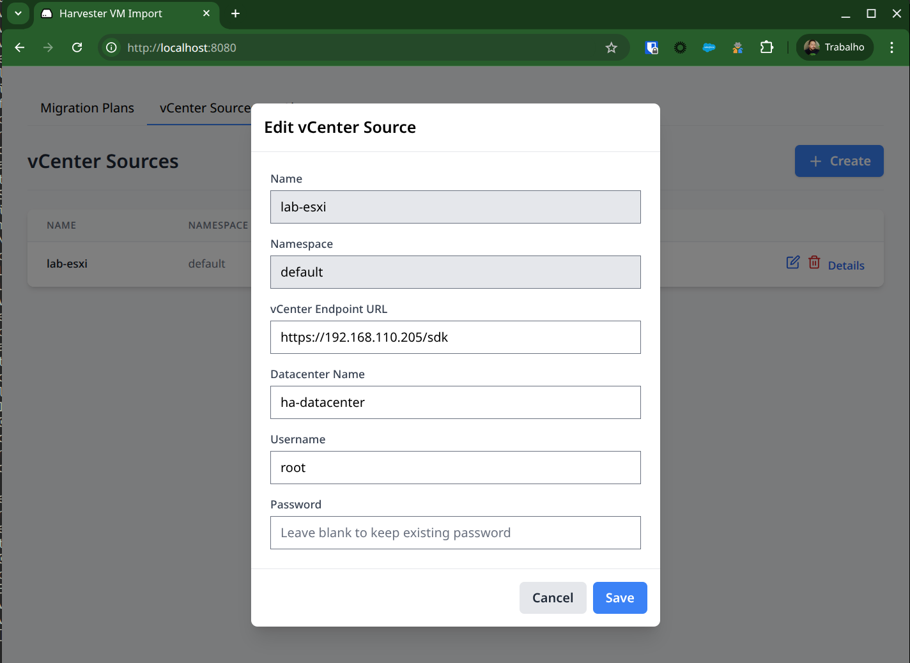

Browse the vCenter inventory and select a VM:
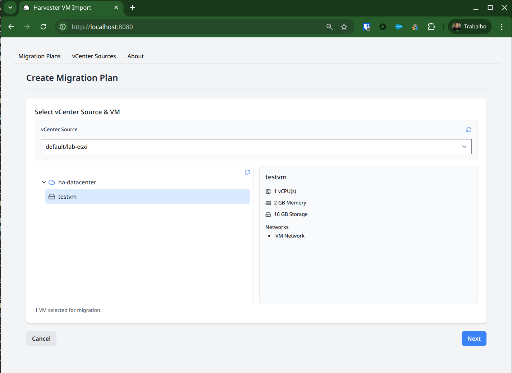

Configure the destination VM:
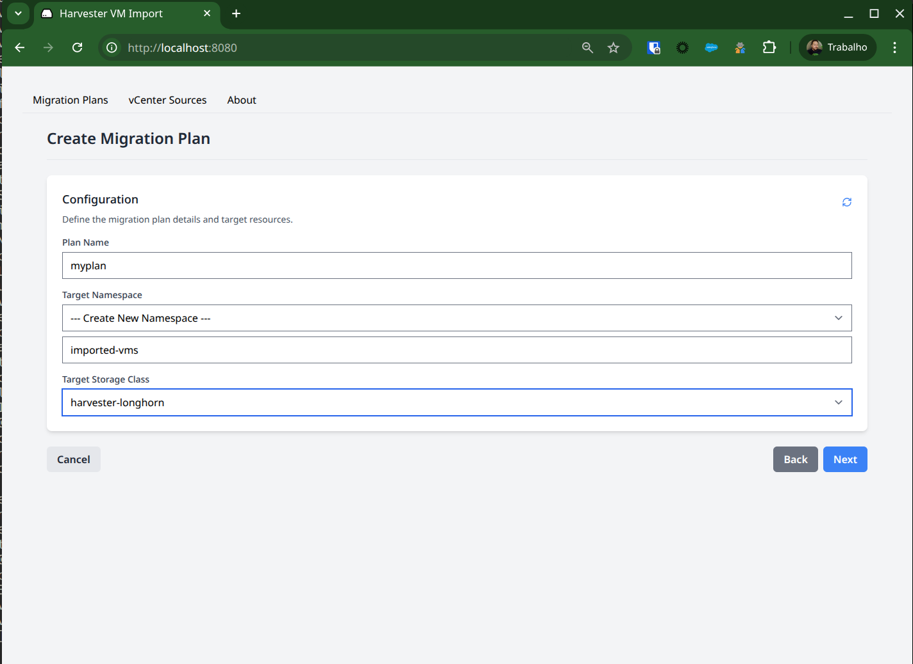

Map source and destination networks:
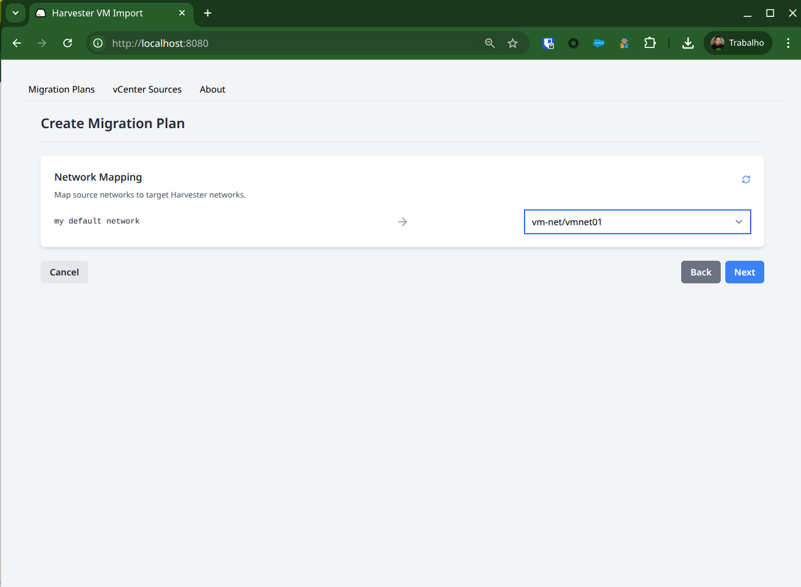

Review the migration plan summary:
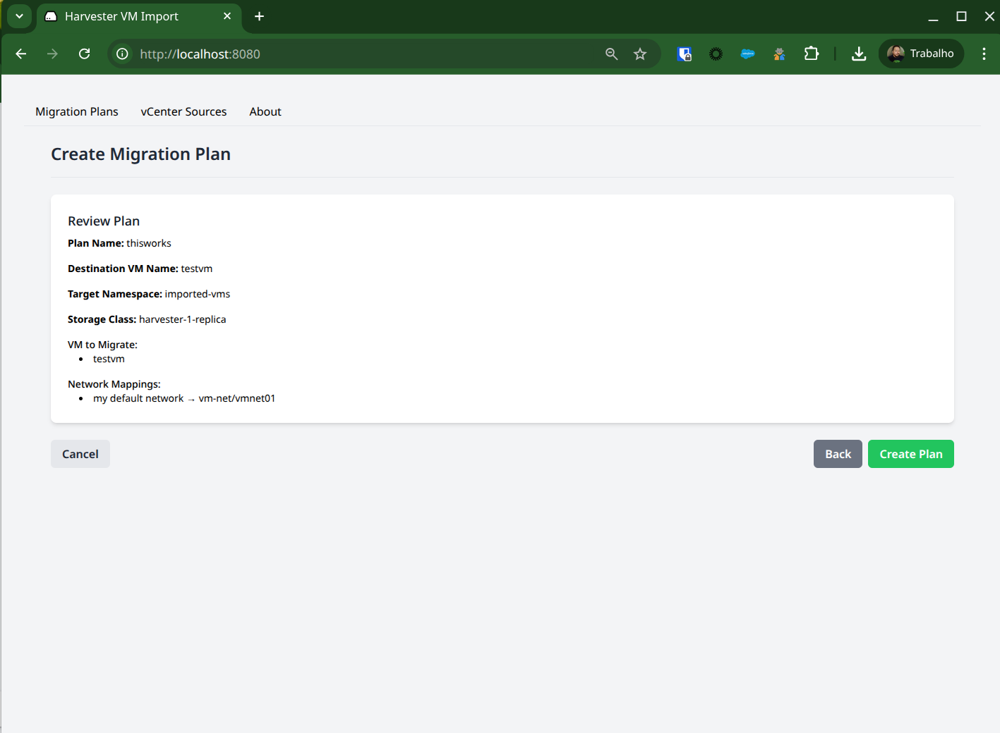

Migration plan created and submitted:


Monitor migration progress:
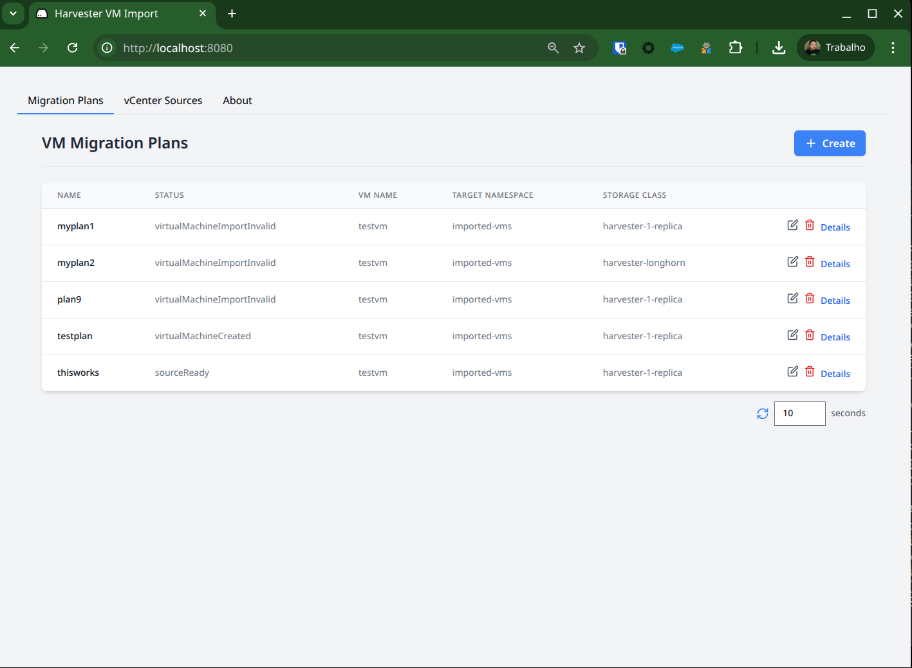

VM successfully created in Harvester:
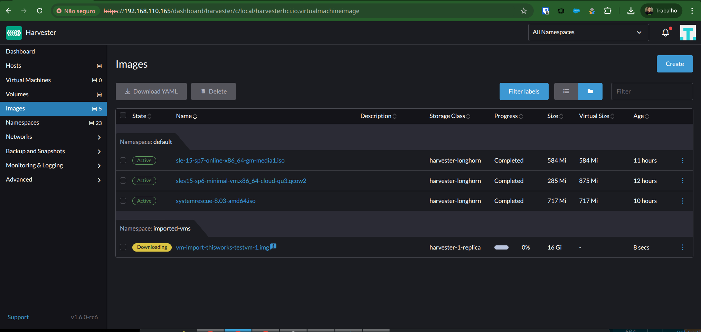

YAML view for a migration plan:
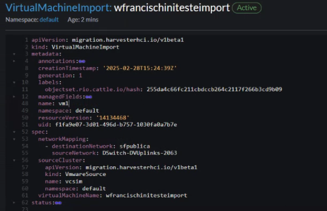

---

## Screenshots — Forklift

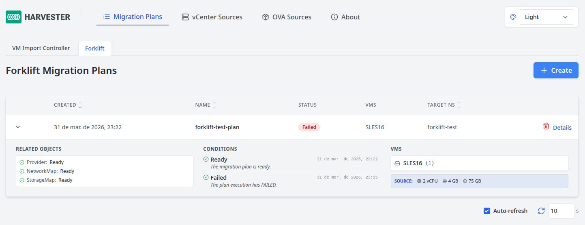

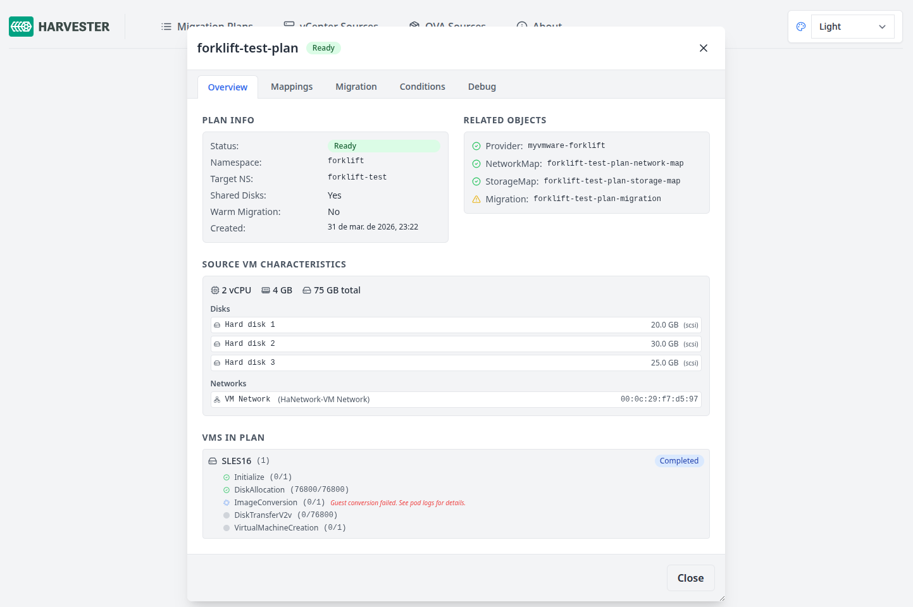

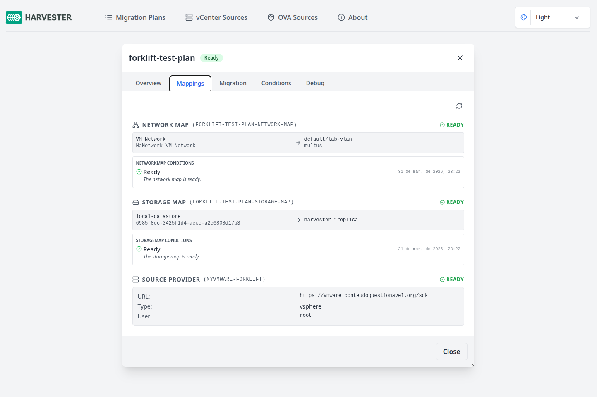

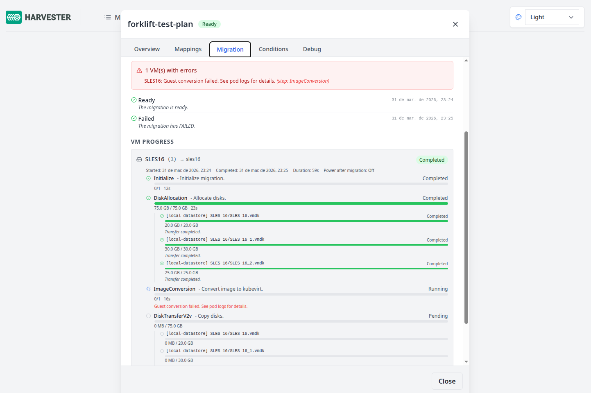

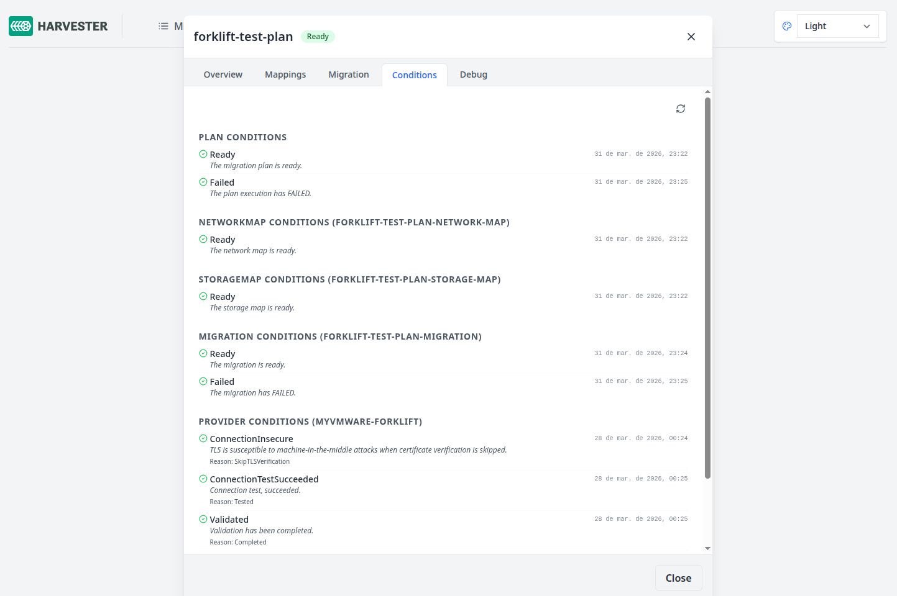

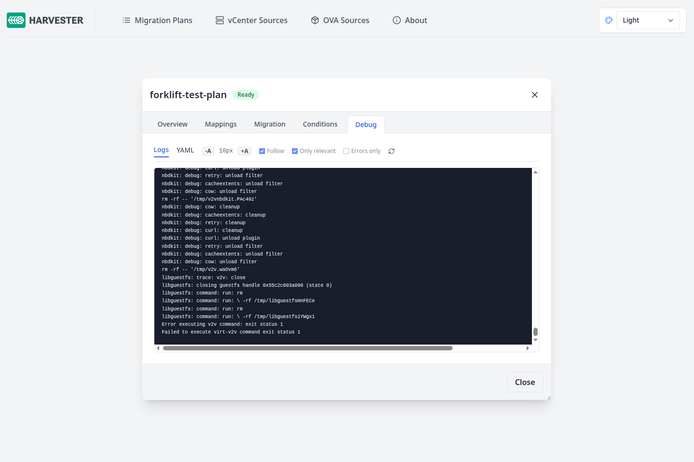

---

## Building Locally

**Step 1 — Build the container image**

```bash
podman build -t vm-import-ui:local .
```

**Step 2 — Run the container**

```bash
podman run -p 8080:8080 \
  -v ~/.kube/config:/kubeconfig:ro \
  -e KUBECONFIG=/kubeconfig \
  vm-import-ui:local
```

**Step 3 — Enable debug logging**

```bash
podman run -p 8080:8080 \
  -v ~/myharvester-kubeconfig:/kubeconfig:ro \
  -e LOG_LEVEL=debug \
  vm-import-ui:local
```

**Run tests**

```bash
# Go backend
cd pkg && go test -v ./...

# React frontend
cd frontend && npx react-scripts test --watchAll=false
```

---

## Environment Variables

| Variable | Default | Description |
|----------|---------|-------------|
| `KUBECONFIG` | `/kubeconfig` | Path to kubeconfig file |
| `LOG_LEVEL` | `info` | Log level: `debug`, `info`, `warn`, `error` |
| `UI_PATH` | `/ui` | Path to frontend build directory |
| `USE_MOCK_DATA` | `false` | Run without a Kubernetes cluster (dev mode) |
| `EXPORT_ROOT` | — | This pod's mount of the export volume. Unset disables status reads and downloads |
| `EXPORT_PVC` | — | ReadWriteMany claim the export Jobs mount |
| `EXPORT_IMAGE` | — | Image the export Jobs run (normally this same image) |
| `EXPORT_MAX_CONCURRENT` | `2` | Maximum simultaneous export Jobs |
| `EXPORT_TTL_SECONDS` | `0` | Seconds a finished export Job is kept; `0` keeps it until the export is deleted in the UI (which also removes the OVA). If a Job expires, its OVA stays on the volume but can no longer be listed, downloaded or deleted from the UI |
| `EXPORT_DOWNLOAD_MAX_BYTES` | `2147483648` | Server-side cap on browser downloads |
| `EXPORT_RUN_AS_USER` / `EXPORT_FS_GROUP` | `0` | Export Job security context (block devices land as `root:disk`) |

> **Upgrading with Helm:** `helm upgrade --reuse-values` reuses the *previous release's computed values, including the old chart's defaults*, so it keeps a previous default such as `export.ttlSecondsAfterFinished: 3600` instead of picking up a new one. Use `--reset-then-reuse-values` (keeps only the values you set yourself, takes new chart defaults), or set the value explicitly.

---

## Latest Release (v1.9.2)

**Deleting an export now removes its files in every namespace.**

- Deleting an export with purge used to remove files only under the API pod's own
  export volume. For a VM in any other namespace the OVA and its status folder were
  left behind after the export's record was deleted, and a same-named OVA on the
  pod's own volume could be removed instead. A short-lived cleanup Job now runs in
  the export's namespace and removes the files there; the export is kept if that
  cannot be scheduled, so the delete can be retried.
- Docs: the `helm upgrade --reuse-values` pitfall that keeps an old chart default.

---

## Release (v1.9.1)

**Export records are kept until deleted.**

- Finished export Jobs are no longer expired after an hour. The Job is an export's
  only record, so when it expired the OVA was left on the export volume with no way
  to list, download or delete it from the UI. `EXPORT_TTL_SECONDS` /
  `export.ttlSecondsAfterFinished` now default to `0` (keep until the export is
  deleted, which also removes the OVA); set a value above `0` to expire Jobs again.
- README: chunking is described as it now behaves (only when USTAR requires it, in
  whole 512-byte sectors), and the virt-v2v re-import limitation for chunked OVAs is
  documented.

---

## Release (v1.9.0)

**VM Export (Harvester → OVA)** — the reverse of the import path.

- New **Export VMs** page: cluster-wide VM browser grouped by namespace, with per-VM
  disks, NICs, firmware and export eligibility
- Three OVF target profiles — `vmware` (vSphere/ESXi), `portable` (VirtualBox,
  Proxmox, oVirt) and `faithful` (virtio preserved, KVM/libvirt)
- **Preview the OVF descriptor** for any VM without touching the cluster
- Exports run as Kubernetes Jobs: disks mounted read-only, converted with
  `qemu-img`, packaged as a DSP0243-conformant OVA on a ReadWriteMany volume
- Disks that exceed USTAR's 8 GiB per-member cap are **chunked** per the spec, in
  whole 512-byte sectors, so exports are not limited by it
- Running VMs are blocked from export — their ReadWriteMany block volumes would
  yield a torn image
- Validated against `xmllint`/DSP8023, `virt-v2v`, VMware VDDK and `ovftool`, and
  deployed and booted end-to-end on ESXi 8.0.3

> Guests need their initramfs rebuilt without host-only mode before exporting to
> the `vmware`/`portable` profiles — see the VM Export section above.

Chart: `export.enabled=false` by default; no new RBAC unless enabled.

---

## Release (v1.8.1)

- **Works behind a sub-path / reverse proxy** (e.g. the Rancher cluster Service proxy): the frontend now loads assets via relative paths and rewrites API calls relative to where it is served, so the in-dashboard NavLink renders fully. Direct NodePort/Ingress/podman access at the root path is unchanged.
- **Graceful API errors instead of crashed connections**: a panic-recovery middleware returns HTTP 500 on handler panics, and the capabilities endpoint degrades to defaults when no cluster is reachable (e.g. `USE_MOCK_DATA=true`).
- Helm chart: Rancher Apps integration (icon, README, install form), a `ui.cattle.io` **NavLink** menu entry (group defaults to "Utilities"), and chart `appVersion` auto-synced to the app version on release.

## Release (v1.8.0)

- **Edit VMIC migration plans**: the VM Import Controller plans table now offers an Edit action (the Play button, which VMIC never needed, was removed). Edit a plan's VM name, folder, storage class, network mapping, and advanced options (force power off, skip preflight, shutdown timeout, default NIC model, disk bus) to fix an invalid plan in place
- **Recover invalid plans without recreating**: saving an edit clears `status.importStatus` so the vm-import-controller re-runs preflight — previously an invalid plan was a dead end (the controller treats `virtualMachineImportInvalid` as terminal)
- **Network mapping editing** reads source NICs from the plan itself (no vCenter round-trip) and warns when a source NIC is left unmapped, which VMIC rejects
- **Untagged networks** (e.g. `local-network`) now appear in the network-mapping dropdowns alongside VLAN networks
- **VM name pre-validation**: the create wizard and edit modal warn when a source VM name won't lowercase to a valid Kubernetes name (e.g. spaces/dots) — VMIC derives the destination name from the source name and would otherwise fail with a cryptic invalid status

### v1.7.2

- **Support Bundle**: one-click diagnostics archive from the About page — redacted `.tar.gz` with cluster state, all migration/provider CRs, conditions, and optional live vCenter inventory; secret values never included; anonymization option available
- Support bundle button shows a loading spinner while the archive is being assembled and surfaces errors inline
- PortGroup discovery support in vCenter network mapping
- TLS skip-verify and custom CA certificate options for Forklift vSphere providers
- VDDK init image configuration for Forklift providers (dramatically faster disk transfer; correct annotation applied when no VDDK image is set)

### v1.7.0

- Full Forklift (MTV) support: provider management, plan creation, migration lifecycle, detailed plan view with log aggregation
- OVA provider support via Forklift (NFS-mounted OVF/OVA files)
- Warm migration, shared disk, and static IP preservation options for Forklift
- Three UI themes (Light, SUSE, Dark)
